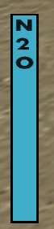
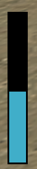

<h1 align="center">Nitro Bar</h1>

    
    

**Este sistema añade un medidor visual de nitro en pantalla mediante textdraws. Al conducir, el jugador ve una barra azul y el texto `N₂O` que reflejan el consumo y recarga del nitro en `tiempo real`. El sistema detecta cuándo se usa la tecla `CTRL` o `disparo` para activar el nitro y ajusta la barra `dinámicamente`**.

## Aclaración

**Puede modificar o ajustar cualquier parte del sistema si lo necesita. También puede corregir textos, mejorar las funciones o agregar detalles que crea útiles. Así podrá adaptarlo mejor a su proyecto o a la forma en que prefiera que funcione el sistema.**

## Creditos
- [Idea y versión original](https://samp-vicioz.blogspot.com/) - **(Riddick)**
